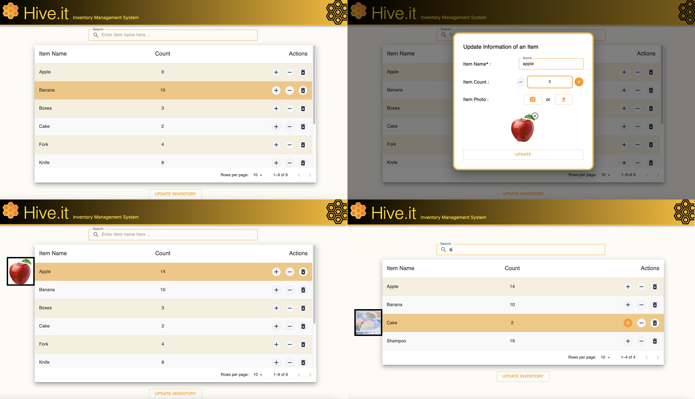

# Hive.it Inventory Management System 🍯

This is the official repository for [Hive.it](https://hive-it-inventory-management.vercel.app), an inventory management system with real-time CRUD (Create, Read, Update, Delete) operations, easy search functionality, and photo previews!

## Highlight Features
### Smooth Real-Time Update
Hive.it provides different ways to manage the item counts, aiming for an easy breeze for all use cases:
1. quick add/reduce/delete shortcut action buttons following each item entry 
2. a form to update existing items or add new items by several instances at a time. No need to tire your finger to press shortcut buttons multiple times!

There is always a way that suits you the best, and the updates will show up immediately without the need to refresh the page!

    

### Easy Search
Type some letters and press Enter! Now you can see all items with names containing what you have typed! You don't have to worry about upper-lower-case mess. I've got you covered ;) 

    

### See the Items
Take a picture directly on Hive.it or upload a photo you already have of an item. When you hover over the table row showing that item's information, you will see its photo popping up!

    

### Neat Naming and Ordering
The item names are automatically capitalized and the record is in alphabetical order! Looking so neat and so easy to find what you are looking for!!

    

